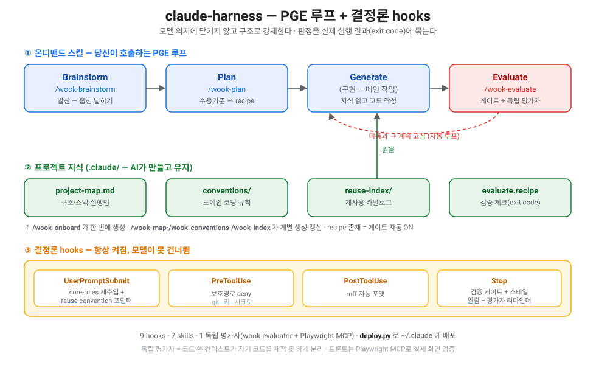

# claude-harness

형욱의 개인 **Claude Code 하네스(harness)** — hooks · skills · agent 로 Claude Code에
"모델이 어길 수 없는 결정론적 바닥"과 "검증 기반 작업 루프(PGE)"를 입힌다.

> 핵심 철학: **모델이 잘 따라주길 기대하지 말고, 따를 수밖에 없는 구조를 만든다.**
> 제약을 권고(CLAUDE.md 같은 말)가 아니라 강제(hook 코드)로 내리고, 판정을 "말"이 아니라
> 실제 실행 결과(exit code·관찰 사실)에 묶는다.

- 설계 명세(source of truth): [`docs/claude-harness-design.md`](docs/claude-harness-design.md)
- 실제 빌드 기록: [`docs/build-log.md`](docs/build-log.md)



---

## 무엇을 해결하나

| 문제 | 해결 | 구성요소 |
|------|------|----------|
| 대화가 길어지면 초반 지침을 잊음 | 상시 규칙은 `~/.claude/CLAUDE.md`(1회 로드·캐시·compaction 생존), 진행 중 plan의 수용 기준은 매 턴 재주입 | deploy 렌더 + hook `inject_plan_pointer` |
| 시키지 않은 걸 멋대로 함 / 보호 파일 편집 | `.git`·키·시크릿 Edit/Write 차단, 게이트 기준 파일은 ask | hook `guard_paths` |
| 파국적 명령을 자동 실행 | rm -rf 홈/루트, force-push, reset --hard 등은 **ask**(사람이 결정) | hook `guard_bash` |
| 스타일을 안 지킴 | 편집 직후 자동 포맷 | hook `format_py` |
| "테스트 안 돌리고 됐다고 함" | **커밋 시 실제 검증**, 통과 전엔 커밋 차단 — git 네이티브 `pre-commit` | 커밋 게이트 `gate_runner` |
| 막히면 같은 수정 무한 반복 | 같은 실패 3연속이면 게이트가 "멈추고 사람에게" 지시 | `gate_runner` stall 감지 |
| 본인이 자기 코드를 후하게 평가 | **독립** 평가자가 도메인 맞는 방식으로 실제 검증 | `wook-evaluate` + `wook-evaluator` |
| 기존 코드 중복 생성 / 규칙 안 지킴 | 프로젝트 지식(.claude/)을 읽고 재사용·준수 | `wook-index` / `wook-conventions` |
| 매번 "어떻게 띄우지?" 재발견 | 구조·스택·실행법을 지도로 유지 | `wook-map` |

---

## 1. 최초 설정 (한 번만)

**필요한 것:** Python 3 · Git (모든 hook은 Python stdlib). 선택: ruff(파이썬 포맷), Node(JS/TS 검증),
Playwright MCP(프론트 화면 평가용).

```bash
git clone https://github.com/sleepy-wook/my-claude-harness.git
cd my-claude-harness
python deploy.py          # claude/ → ~/.claude 배포 + settings.json hooks 병합 + CLAUDE.md 렌더 (멱등)
```
- 미리 보기: `python deploy.py --check`. 배포되는 것: `hooks/`·`harness/`·`agents/`·`skills/` + `CLAUDE.md`(상시 규칙).
- 프로젝트에서 recipe를 쓰기 시작하면 `python ~/.claude/harness/install_gate.py`로 그 repo에 커밋 게이트 설치
  (`/wook-plan`·`/wook-onboard`가 recipe 쓸 때 같이 해준다).
- **Claude Code 재시작** — 스킬/에이전트는 세션 시작 시 로드(첫 배포 후 1회). hook은 재시작 없이 곧 반영.
- 새 PC 복원: `clone → deploy → 재시작` 반복.

### 멀티 에이전트 — Codex도 지원 (v1)
같은 소스를 Codex로도 배포한다 (Codex가 hooks/skills/MCP를 Claude와 거의 동일 스키마로 미러):
```bash
python deploy.py --target=codex     # ~/.codex 로: hooks.json·skills/·AGENTS.md·agents/wook-evaluator.toml
```
- hook **스크립트는 공유**(stdin JSON 스키마 동일). 다른 건 등록 파일(settings.json↔`hooks.json`)·규칙 파일
  (core-rules↔`AGENTS.md`)·평가자 래퍼(`.md`↔`.toml`)뿐 — 어댑터가 얇다.
- **프로젝트 아티팩트도 도구별**: Claude는 프로젝트 `.claude/`, Codex는 `.codex/`(conventions·reuse-index·
  project-map·recipe). deploy가 `.claude`→`.codex`로 치환해 배포하므로 Codex 프로젝트엔 `.codex/`만 생긴다.
- ⚠️ **정직한 한계:** Codex `apply_patch` 편집 hook 발동·정확한 스키마는 **설치된 Codex 버전에서 경험적
  확인** 필요(hooks는 v0.124.0+). 자동포맷·보호경로 deny가 여기 달림.

---

## 2. 스킬 한눈에

| 스킬 | 한 줄 | 단계 |
|------|------|------|
| [`/wook-brainstorm`](#wook-brainstorm) | 발산 — 옵션 넓히기 | PGE 이전 |
| [`/wook-plan`](#wook-plan) | 코드 전에 "완료" 정의 → recipe | Plan |
| [`/wook-evaluate`](#wook-evaluate) | 독립 평가자로 실제 검증 | Evaluate |
| [`/wook-onboard`](#wook-onboard) | 기존 repo 한 방 온보딩 | 셋업 |
| [`/wook-map`](#wook-map) | 프로젝트 지도(구조·스택·실행법) | 지식 |
| [`/wook-conventions`](#wook-conventions) | 도메인 코딩 컨벤션 | 지식 |
| [`/wook-index`](#wook-index) | 재사용 카탈로그 | 지식 |
| `/wook-audit` | 전체 트리 상시 감사 원장(`.claude/audit/`) | 지식 |
| `/wook-sandbox` | 격리 제작 → 써보고 → 졸업(실제 경로로 이동) | 제작 |
| `/wook-palette` | pro-max 토큰의 **AA 관문** — 걔네 16역할을 CSV서 회수 → 대비 계산 → tokens.css | 디자인 |

> 트리거는 직접 타이핑(`/wook-plan`)하거나, 설명에 맞는 상황이면 Claude가 알아서 제안한다.
> (`/wook-audit`·`/wook-sandbox`·`/wook-palette`는 상세 절 없이 스킬 본문이 안내 — SKILL.md 참조.)

### 디자인 흐름 — **하네스가 pro-max에 맞춘다** (2026-07-17~)

발상·스타일·레이아웃·스키마는 서드파티 **ui-ux-pro-max**(107k★, `npm i -g ui-ux-pro-max-cli
&& uipro init --ai claude --global`, repo 밖에서 자동 업데이트)가 **메인**이다. 우리는 걔네
어휘(`--color-*` 16역할)를 그대로 쓰고 — 그래야 걔네 22개 스택 코드 생성이 우리 토큰을 그대로
먹는다 — 걔가 **안 하는 것 하나**만 얹는다: **대비를 계산해 exit code에 묶는 것.**

```
ui-ux-pro-max  --design-system     발상·패턴·스타일·타이포 (+ MASTER.md = 디자인 소스 오브 트루스)
      ↓
/wook-palette  --from-promax       CSV에서 16역할 회수 (걔네 렌더러는 6役을 버림 — On Accent 포함!)
               --check / --fix     WCAG AA 계산 → 미달이면 exit 1 / ink만 수리(브랜드색 불변)
      ↓                            recipe에 tokens-aa 심기 → 이후 커밋 게이트가 강제
/wook-sandbox                      격리 제작 → 직접 써보고 → 졸업
      ↓
wook-evaluator + 커밋 게이트          실제 실행으로 검증
```

**왜 계산이 필요한가 (실측 2026-07-17):** pro-max 팔레트는 **1517쌍 중 571쌍(37.6%)이 AA 미달**
— 특히 CTA 글자(`On Accent/Accent`)가 192개 중 **113개**에서 실패한다. 게다가 걔네 렌더러가
`On Accent` 칸을 화면에 안 보여줘서, 에이전트가 흰색을 추측해 **2.28:1 CTA를 출고한 실사고**가
있었다(정답 `#0F172A`=7.83:1은 걔네 CSV에 이미 있었다). 걔네 규칙(§1 "대비 4.5:1 = CRITICAL")은
우리와 같다 — **아는데 계산을 안 할 뿐**이라, 넓이는 걔네 것이고 검증이 우리 몫이다.
(구 `/wook-design`·프리셋 12종은 폐기 — pro-max 192행 + `--fix`가 상위 호환.)

---

## 3. 스킬 상세

<a id="wook-brainstorm"></a>
### `/wook-brainstorm` — 발산 (아직 답이 안 정해졌을 때)
- **무엇:** 문제·접근이 열려 있을 때 서로 다른 접근 **2~4개**를 펼치고 트레이드오프를 드러낸다. 코드·recipe를 만들지 않는다.
- **언제:** "어떻게 접근하지", "옵션이 뭐가 있지", 방향이 모호할 때. (방향이 정해졌으면 `/wook-plan`)
- **어떻게:** `/wook-brainstorm <문제>` → (모호하면 질문) → 접근안 비교 → 추천(결정은 당신) → 방향이 잡히면 `/wook-plan`으로 핸드오프. 넓은 탐색은 **읽기전용 sub-agent로 fan-out**.
- **산출물:** 없음(논의). 다음은 Plan.

<a id="wook-plan"></a>
### `/wook-plan` — 코드 전에 "완료"를 정의
- **무엇:** 짧은 요청을 *실행 가능한 수용 기준* 스펙으로 확장하고, 그 기준을 `.claude/evaluate.recipe`로 박은 뒤 **커밋 게이트(`.git/hooks/pre-commit`)를 설치**한다(작고 빠른 set로 유지). 이후 `git commit` 때마다 그 기준으로 검증된다.
- **언제:** 중간 규모 이상 기능 시작 전. "plan this", "수용 기준 정의".
- **어떻게:** `/wook-plan <기능>` → (모호하면 질문) → SPEC(범위/엣지/수용기준) 제시 → recipe 제안 → 승인 → `.claude/{evaluate.recipe, plan.md}` 작성 → 구현. 기준은 *머신이 실제로 돌릴 수 있는 것*만(테스트 통과, exit 0, 200 응답…).
- **산출물:** `.claude/evaluate.recipe`, `.claude/plan.md`.

<a id="wook-evaluate"></a>
### `/wook-evaluate` — 독립 평가자로 실제 검증
- **무엇:** 코드 쓴 본인이 아니라 **독립 컨텍스트의 `wook-evaluator` 서브에이전트**가, 도메인에 맞는 방식으로 *실제로 굴려* 검증한다.
- **언제:** 사소하지 않은 변경을 완료 선언하기 직전. "이거 진짜 되나", "verify this".
- **어떻게:** `/wook-evaluate [범위]` → wook-evaluator 디스패치 → `.claude/evaluate.recipe` 실행 **+ 도메인 평가**:
  - **frontend** → Playwright MCP로 실제 화면(렌더·플로우·콘솔) 확인
  - **backend** → 엔드포인트 호출, 상태/응답/로그
  - **db** → 쿼리로 스키마·데이터
  - → `VERDICT: PASS | FAIL | INCONCLUSIVE` 를 **그대로** 전달(거짓 PASS 금지; 못 돌리면 INCONCLUSIVE).
- **자동 리마인더:** 커밋 직후 1회, 커밋이 충분히 클 때만(≥30줄) "독립 평가자 돌려"라고 알린다(사소 판단은 본인 몫 — 매 턴 잔소리 X).
- **관련:** `wook-evaluator`(agent)는 도구가 `Bash·Read·Grep·Glob·Playwright MCP`로 제한 — **코드 못 고침**(판정만), 빌트인 브라우저 대신 Playwright MCP만.

<a id="wook-onboard"></a>
### `/wook-onboard` — 기존 repo 한 방 온보딩
- **무엇:** `.claude/`가 텅 빈 **기존(진행 중) 프로젝트**를 훑어 harness 세트를 한 번에 만든다.
- **언제:** 진행 중 repo에 harness를 처음 깔 때. "set up the harness here".
- **어떻게:** `/wook-onboard` → 스캔(읽기전용, fan-out 가능) → ① `project-map.md` → ② `evaluate.recipe`(발견한 test/lint/build에서 베이스라인) → ③ `conventions/<domain>.md` → ④ `reuse-index/<domain>.md` 초안 → **요약 보여주고 승인 → 작성**. 멱등(기존 파일 안 덮음).
- **산출물:** 위 4종 한 번에. (개별 갱신은 아래 셋으로.)

<a id="wook-map"></a>
### `/wook-map` — 프로젝트 지도 (구조 + 스택 + 실행법)
- **무엇:** `.claude/project-map.md`. **고정 스키마**(`Stack & Run` / `Structure` / `How to exercise` / `Entry points`). 평가자가 이걸 읽어 앱을 띄우고 굴린다.
- **언제:** 구조·스택·실행/빌드/테스트 방법이 바뀜. "document how to run this project".
- **어떻게:** `/wook-map` → 코드·설정 훑어 스키마대로 작성. 실행 명령은 `package.json`/`pyproject`/`compose`에서 **derive + `# 출처` 포인터**(복제 아님 → 안 낡음). Structure는 ≤2레벨.
- **산출물:** `.claude/project-map.md`.

<a id="wook-conventions"></a>
### `/wook-conventions` — 도메인 코딩 컨벤션
- **무엇:** `.claude/conventions/<domain>.md`(테마·색·네이밍·API 형태…). 값은 실제 소스(`path:symbol`) 포인터로.
- **언제:** 컨벤션을 정하거나 추출. greenfield=질문하며 확정(코딩 전) / brownfield=도메인 코드 훑어 추출 + 불일치 플래그.
- **어떻게:** `/wook-conventions <domain>` → 모드 감지 → 초안 → 승인 → 작성. **기계검증 가능 규칙**(예: raw-hex 금지)은 `.claude/evaluate.recipe`에 체크로 추가 제안 → 게이트가 강제.
- **산출물:** `.claude/conventions/<domain>.md` (+ 공통은 `shared.md`).

<a id="wook-index"></a>
### `/wook-index` — 재사용 카탈로그
- **무엇:** `.claude/reuse-index/<domain>.md`. 항목당 `이름 · 한줄설명 · path:symbol`. 새 코드 짜기 전 **중복 생성 방지**.
- **언제:** 공유 유틸/컴포넌트/쿼리 추가 후. "build the reuse catalog".
- **어떻게:** `/wook-index` → 재사용 가능한 표면을 도메인별로 묶어 매니페스트 작성(포인터가 실제 코드로 해석되는지 확인). 상세는 실제 소스라 안 낡음.
- **산출물:** `.claude/reuse-index/<domain>.md`.

---

## 4. 프로젝트별 산출물 (`.claude/`)

스킬이 만들고 AI가 유지하는, 프로젝트마다 사는 파일들. **"파일 존재 = 그 기능 ON"**.

| 경로 | 무엇 | 만드는 스킬 | 읽는 곳 |
|------|------|------------|---------|
| `evaluate.recipe` | 검증 체크(`name: 셸명령`, exit 0=통과) | wook-plan / onboard | 게이트 · wook-evaluate |
| `plan.md` | 스펙(컨텍스트 생존용) | wook-plan | 사람 · AI |
| `project-map.md` | 구조·스택·실행법(고정 스키마) | wook-map / onboard | wook-evaluator · 모든 작업 |
| `conventions/<d>.md` | 도메인 코딩 규칙 | wook-conventions / onboard | `inject_convention_pointer` |
| `reuse-index/<d>.md` | 재사용 카탈로그 | wook-index / onboard | `inject_reuse_pointer` |
| `evaluate-off` | (빈 파일) 게이트 끄기 | 수동 | 게이트 |

---

## 5. 결정론 hooks (항상 켜짐, 모델이 못 건너뜀)

hook은 생명주기 특정 시점에 **반드시** 실행되는 스크립트다. 프롬프트와 달리 모델이 무시 못 한다.

| 이벤트 | 하는 일 | 스크립트 |
|--------|---------|----------|
| `UserPromptSubmit` | 진행 중 plan의 수용 기준 재주입(compaction 생존) | `inject_plan_pointer.py` |
| `UserPromptSubmit` | 재사용 카탈로그 포인터 주입 | `inject_reuse_pointer.py` |
| `UserPromptSubmit` | 컨벤션 포인터 주입 | `inject_convention_pointer.py` |
| `PreToolUse` (Edit\|Write) | 보호 경로 deny(.git·키·시크릿) + 게이트 기준 파일 ask | `guard_paths.py` |
| `PreToolUse` (Bash\|PowerShell) | 파국 명령 ask(rm -rf 홈/루트, force-push, reset --hard, 게이트 우회…) | `guard_bash.py` |
| `PostToolUse` (Edit\|Write) | `.py` 자동 포맷(ruff) | `format_py.py` |
| `PostToolUse` (Bash) | 커밋 직후 1회, 큰 커밋(≥30줄)일 때만 "독립 평가자 돌려" 리마인더 | `remind_evaluator.py` |

**커밋 게이트는 hook이 아니라 git 자체에 산다** — `.git/hooks/pre-commit`(설치:
`python ~/.claude/harness/install_gate.py`)이 `gate_runner.py`를 실행해 recipe를 검증한다.
어느 에이전트든, 사람이 터미널에서 커밋해도 동일하게 걸리고, `--no-verify`가 네이티브 우회다.
게이트는 ① recipe 실행(미통과면 커밋 차단) ② **자기보호**(staged에 recipe 변경/테스트 삭제가
섞이면 `GATE_EDIT_OK=1` 없이는 차단 — 기준 약화는 사람이 승인) ③ **stall 감지**(같은 실패
3연속이면 "반복 말고 사람에게") ④ reuse/convention 스테일 포인터 경고(차단 아님)를 수행한다.

모든 스크립트는 문제가 생겨도 작업을 막지 않도록 안전하게 빠진다. 검증은 매 턴이 아니라
**커밋(한 단위 완료) 시점**에만 돌아 자잘한 수정·질문엔 발동하지 않는다.

- 상시 규칙(standing rules) 편집: repo의 `claude/harness/core-rules.md` 고치고 `python deploy.py`
  → `~/.claude/CLAUDE.md`의 marked block으로 렌더(블록 밖 내용은 보존). **다음 세션부터 반영.**

---

## 6. 원리 (PGE + 레시피 + 배포)

- **PGE (Planner→Generator→Evaluator):** "생성하는 자"와 "비판하는 자"를 분리한다. 코드를 쓴 컨텍스트가
  자기 코드를 칭찬 못 하게, 평가자는 **독립 컨텍스트**에서 돈다. 판정은 실제 실행 결과(exit code·관찰 사실)에 묶인다.
- **검증은 하드코딩이 아니라 레시피:** stack을 추측하지 않고 프로젝트가 `.claude/evaluate.recipe`에
  선언한다. 템플릿 `~/.claude/harness/evaluate.recipe.example`. 게이트 끄기 = `.claude/evaluate-off`.
- **도메인 맞는 평가:** 결정론으로 되는 건(백/db/빌드) 레시피로, **눈으로 봐야 하는 프론트는 Playwright
  MCP로** 독립 평가자가 본다.
- **source-of-truth + 배포:** 실제 하네스는 비밀 많은 `~/.claude`에 사니 직접 git하지 않는다. **이 repo가
  원본**, `deploy.py`가 복사 — repo엔 비밀이 0이라 구조적으로 안전.
- **검증된 운반체 우선(v2):** 같은 목적이면 손수 만든 메커니즘보다 네이티브를 쓴다 — 게이트는
  Bash 명령 파싱 대신 git `pre-commit`, 상시 규칙은 매 턴 주입 대신 `CLAUDE.md`(1회 로드·캐시).
  줄어든 건 유지할 코드와 매 턴 토큰이고, 기능은 그대로다.

### 하네스 자체를 업데이트할 때
```bash
# claude/ 아래 파일을 고친 뒤
python deploy.py                                   # ~/.claude 에 반영
git add -A && git commit -m "..." && git push      # 백업/동기화
```

---

## repo 구조
```
my-claude-harness/
├─ README.md · CLAUDE.md
├─ docs/
│  ├─ claude-harness-design.md     # 설계 명세 (source of truth)
│  ├─ build-log.md                 # 실제 빌드 기록
│  └─ harness-overview.svg         # 위 구조 다이어그램
├─ claude/                         # ~/.claude 로 배포되는 원본 (비밀 0)
│  ├─ hooks/                       # 7개 hook 스크립트 (guard·inject·format·remind)
│  ├─ harness/                     # core-rules + gate_runner/install_gate + 템플릿
│  ├─ agents/wook-evaluator.md     # 독립 Evaluator 서브에이전트
│  └─ skills/{wook-plan, wook-brainstorm, wook-evaluate,
│             wook-onboard, wook-map, wook-conventions, wook-index}/SKILL.md
├─ tools/                          # selfcheck + 행동 테스트
└─ deploy.py                       # claude/ → ~/.claude 멱등 배포
```
